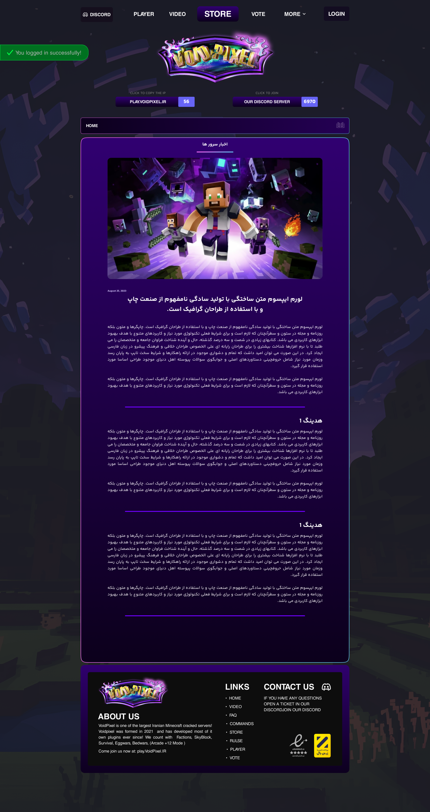
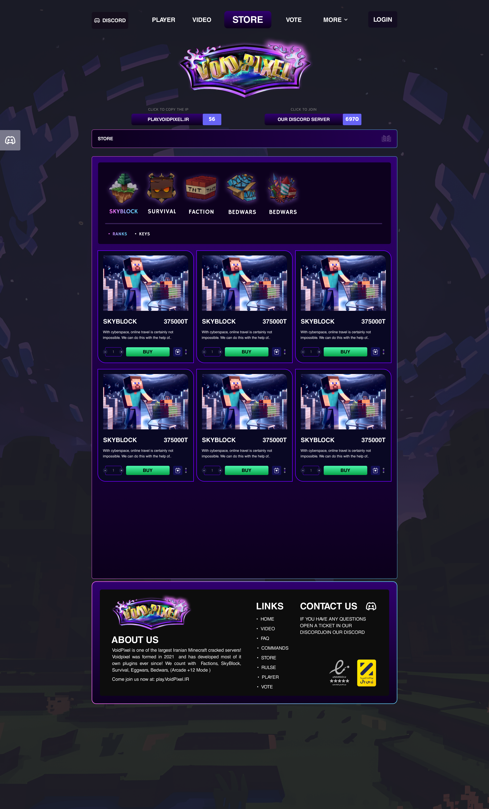
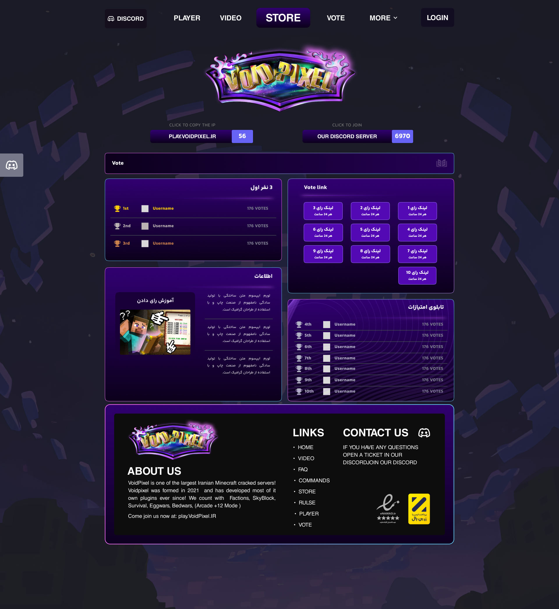
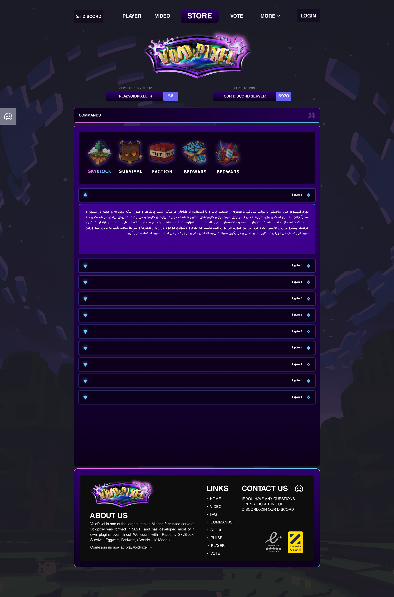

# 🎮 Minecraft Server Management | سیستم مدیریت پیشرفته سرورهای بازی

<strong>Minecraft Server Management</strong> یک پلتفرم جامع و مقیاس‌پذیر برای مدیریت، پایش و فروش سرویس‌های سرور بازی ماینکرفت است. این سیستم با استفاده از یک <strong>معماری دو دیتابیزی (Dual-Database Architecture)</strong>، داده‌های کاربران و تراکنش‌های سایت را با داده‌های لحظه‌ای بازی (In-Game Data) هماهنگ می‌کند.

> ⚠️ **توجه:** کدهای منبع به دلیل محرمانه بودن پروژه اصلی، در اینجا موجود نیستند. این مخزن شامل مستندات فنی، معماری و دموهای وب‌سایت است.

---

## 🚀 ویژگی‌های کلیدی

### 🏗️ معماری پیشرفته (Advanced Architecture)
*   **همگام‌سازی دو دیتابیس (Data Sync):** ارتباط بلادرنگ بین دیتابیس سایت (برای مدیریت کاربران و خریدها) و دیتابیس بازی (برای ذخیره موقعیت، اینونتوری و آمار بازیکنان).

### 🔐 امنیت و پایداری
*   **احراز هویت امن:** استفاده از JWT و مدیریت نشست‌های امن برای دسترسی به پنل ادمین و کاربری.
*   **مدیریت تراکنش‌ها:** اطمینان از صحت پرداخت‌ها و فعال‌سازی سرویس‌ها بدون خطا.

---

## 🛠️ تکنولوژی‌ها و زیرساخت

این پروژه با تمرکز بر **پرفورمنس** و **قابلیت توسعه** ساخته شده است:

| لایه | تکنولوژی | توضیحات |
| :--- | :--- | :--- |
| **Backend** | Python, Django, DRF | هسته اصلی مدیریت وب‌سایت و APIها |
| **Game Integration** | Python (RCON, Socket) | ارتباط مستقیم با سرورهای بازی Minecraft |
| **Database (Site)** | PostgreSQL | ذخیره اطلاعات کاربران، سفارشات و تنظیمات |
| **Database (Game)** | MySQL / MongoDB | ذخیره داده‌های لحظه‌ای بازی (Location, Items) |
| **Task Queue** | Celery + Redis | پردازش وظایف پس‌زمینه (مثل همگام‌سازی داده‌ها) |
| **Infrastructure** | Docker, Nginx | کانتینرایز کردن سرویس‌ها و مدیریت ترافیک |

---

## 📸 دمو و اسکرین‌شات‌ها

### 1. صفحه اصلی

### 2. صفحه فروشگاه

### 3. صفحات دیگه

---
